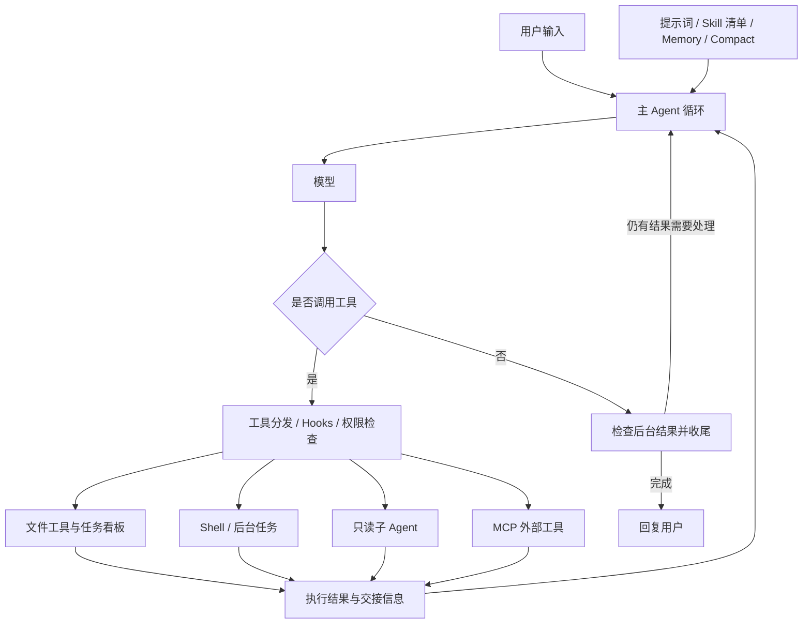

# mini-coding-agent

一个模块化 Python Coding Agent，支持工具调用、只读子 Agent、MCP、Skill、记忆管理与上下文压缩。

用户通过命令行描述任务，Agent 自主选择工具、观察执行结果并继续处理，完成代码阅读、文件修改、命令执行和测试。主 Agent 负责开发与整合，子 Agent 负责可并行的代码分析和审查。

## 项目能力

| 能力 | 说明 |
| --- | --- |
| 文件操作 | 分页读取文件、写入文件、替换文本、匹配路径 |
| 命令执行 | 运行 Shell 命令，支持后台执行并回收结果 |
| 任务看板 | 创建、更新、认领和完成任务，管理任务依赖 |
| 只读子 Agent | 独立上下文、受控并发、运行预算、状态查询、取消和结果交接 |
| Skill | 扫描本地技能清单，按需加载具体指令 |
| MCP | 按需连接 stdio / HTTP 服务，发现并调用外部工具 |
| Memory | 使用本地文件保存记忆，支持索引、召回、提取与合并 |
| Compact | 裁剪和归档历史消息、处理超长工具结果、生成上下文摘要 |
| Hooks 与权限 | 在用户输入、工具执行和任务结束时触发处理，支持拒绝规则与操作确认 |

## 架构设计

`main.py` 负责创建并连接各模块、运行主 Agent 循环，以及退出时的资源清理。功能实现位于 `CodingAgent/`，通过构造参数传入所需依赖。



**主 Agent 与子 Agent 的分工**：主 Agent 可以修改文件和执行命令；子 Agent 通过工具白名单限制为 `read_file`、`glob`、`load_skill`，适合代码调查和审查，不负责写代码或运行测试。默认最多同时运行 4 个子 Agent，上限在 `CodingAgent/config.py` 的 `AgentConfig.max_subagents` 中配置。

**任务与运行的区别**：`task_id` 标识看板中的任务，`run_id` 标识一次子 Agent 运行。主 Agent 先创建并认领任务，再通过 `task` 工具启动子 Agent。启动回执立即返回，最终结果通过 `subagent_result` 交回主循环，由主 Agent 验证和整合。

**后台执行方式**：主循环以同步方式运行；后台 Shell 和子 Agent 使用线程执行。MCP 通过 `AsyncBridge` 在独立线程中维护 asyncio 事件循环，供同步代码提交异步操作。

### 代码结构

```text
mini-coding-agent/
├── main.py                  # 入口、依赖组装、主循环、统一退出
├── CodingAgent/
│   ├── config.py            # 配置与工作目录派生路径
│   ├── prompts.py           # 主 Agent / 子 Agent 提示词
│   ├── messages.py          # 消息文本提取
│   ├── skill_loader.py      # Skill 扫描与加载
│   ├── taskboard.py         # Task 存储与看板操作
│   ├── background.py        # 后台 Shell 管理与结果回收
│   ├── compact.py           # 上下文压缩与归档
│   ├── hooks.py             # 事件注册与处理
│   ├── permissions.py       # 工具权限检查
│   ├── tools/
│   │   ├── files.py         # 文件工具
│   │   ├── shell.py         # 命令与进程管理
│   │   ├── schemas.py       # 提供给模型的工具定义
│   │   ├── adapters.py      # 工具接口适配
│   │   └── dispatcher.py    # 工具分发
│   ├── subagent/            # 状态、执行器、管理器、结果交接
│   ├── mcp/                 # 配置、异步桥接、客户端、工具管理
│   ├── memory/              # 记忆存储与管理
│   └── todo.py              # 保留早期 TODO 实现，当前使用 Task 看板
└── skills/
    ├── count_lines/SKILL.md
    └── python_file_summary/SKILL.md
```

## 快速开始

需要 Python 3.11 和 Git，以及一个支持 Anthropic Messages 格式和工具调用的模型服务。项目使用 Anthropic SDK 访问模型；其他服务需要提供兼容接口。

### 1. 克隆项目并安装依赖

```sh
git clone https://github.com/KCxuan/mini-coding-agent.git
cd mini-coding-agent
```

Windows PowerShell：

```powershell
py -3.11 -m venv .venv
.\.venv\Scripts\Activate.ps1
python -m pip install anthropic==1.2.0 python-dotenv==1.2.3 PyYAML==6.0.3 mcp==2.1.1
```

Linux / macOS：

```sh
python3.11 -m venv .venv
source .venv/bin/activate
python -m pip install anthropic==1.2.0 python-dotenv==1.2.3 PyYAML==6.0.3 mcp==2.1.1
```

如果 PowerShell 不允许激活脚本，可以不激活环境，改用 `.\.venv\Scripts\python.exe` 执行后续的 `python` 命令。

以上是项目使用的直接依赖版本，尚未提供完整依赖锁文件。当前 MCP 代码使用 SDK 的 `Client` 接口，请使用上述版本，避免与旧版接口混用。

### 2. 配置模型

在仓库根目录新建 `.env`：

```dotenv
ANTHROPIC_API_KEY=your-api-key
ANTHROPIC_MODEL=your-model-id
# 使用兼容服务时填写其 API 基础地址；直连默认服务可省略。
# ANTHROPIC_BASE_URL=https://your-provider.example
```

| 环境变量 | 必填 | 说明 |
| --- | --- | --- |
| `ANTHROPIC_API_KEY` | 是 | 模型服务的 API 密钥 |
| `ANTHROPIC_MODEL` | 是 | 服务支持的模型标识，没有内置默认模型 |
| `ANTHROPIC_BASE_URL` | 否 | 兼容服务的 API 基础地址 |

已有进程环境变量优先于 `.env`。运行任务会调用配置的模型服务，并产生相应的 API 用量。

### 3. 配置 MCP 并启动

在仓库根目录新建 UTF-8 编码的 `mcp.json`。暂不使用外部工具时，填写空配置：

```json
{
  "mcpServers": {}
}
```

然后运行：

```sh
python -B -u main.py
```

看到 `s01 >>` 后输入任务，例如：

```text
请加载 python-file-summary Skill，阅读 CodingAgent/config.py，列出其中的类和函数并说明作用，不要修改文件。
```

当前入口按单行读取，长提示词也应作为一行提交。输入 `exit`、`q`、空行或按 Ctrl+C 可退出。

## 在其他工作目录中使用

Agent 使用**启动时的当前目录**作为工作目录，而不是 `main.py` 所在目录。直接在仓库中启动，文件操作就默认针对仓库；如果需要开发其他项目，应切换到目标项目目录后启动。

以下示例从仓库根目录开始，在相邻位置创建一个新的 `agent-workspace`。模型配置继续使用仓库根目录的 `.env`，Skill 和 MCP 配置则放在新工作目录中。

Windows PowerShell：

```powershell
$agentRepo = (Get-Location).Path
$agentPython = Join-Path $agentRepo '.venv\Scripts\python.exe'
New-Item -ItemType Directory -Path ..\agent-workspace
Copy-Item -Path .\skills -Destination ..\agent-workspace\skills -Recurse
Set-Location ..\agent-workspace
'{"mcpServers": {}}' | Set-Content -Path .\mcp.json -Encoding ASCII
& $agentPython -B -u (Join-Path $agentRepo 'main.py')
```

Linux / macOS：

```sh
agent_repo="$PWD"
mkdir ../agent-workspace
cp -R skills ../agent-workspace/skills
cd ../agent-workspace
printf '%s\n' '{"mcpServers": {}}' > mcp.json
"$agent_repo/.venv/bin/python" -B -u "$agent_repo/main.py"
```

对于已有项目，将上述创建目录步骤替换为切换到目标目录，并按需准备 `skills/` 和 `mcp.json` 即可。改变工作目录不会自动复制这些配置。

运行时数据按需生成在工作目录中：

| 路径 | 用途 |
| --- | --- |
| `skills/*/SKILL.md` | 技能清单与指令 |
| `mcp.json` | MCP 服务器配置 |
| `tasks/` | Task 看板记录 |
| `.memory/MEMORY.md`、`.memory/` | 记忆索引与文档 |
| `.transcripts/` | 历史消息归档 |
| `.task_outputs/` | 大型工具结果等输出 |

仓库的 `.gitignore` 已排除密钥配置、虚拟环境和运行数据；在其他项目目录运行时，需要在该项目中自行设置忽略规则。

## 使用示例

**分析已有代码：**

```text
阅读当前项目的目录结构，说明入口和主要模块之间的调用关系，只做分析，不修改文件。
```

**完成开发并验证：**

```text
在 log_analyzer/ 中实现一个仅使用 Python 标准库的 JSONL 日志分析工具，支持 --input 和 --output，统计 INFO、WARNING、ERROR 的数量，忽略空行并统计无效记录。使用 Task 看板管理任务，补充 unittest 测试和 README，实际执行测试后报告结果与退出码。
```

**委派并行审查：**

```text
为刚才的日志分析工具创建并认领两个审查任务，分别启动只读子 Agent 检查实现边界和测试覆盖。子 Agent 不修改文件或执行命令。由主 Agent 收齐交接结果，判断哪些建议需要采纳，完成修复并重新测试，最后报告 task_id、run_id 和验证结果。
```

长时间执行的命令可以要求 Agent 使用后台模式。结果会在后续循环中自动返回，无需把启动回执当作最终结果。验收时以生成的文件、测试输出和命令退出码为依据。

## 扩展方式

### 添加 Skill

在工作目录下创建 `skills/<目录名>/SKILL.md`，使用 YAML frontmatter 定义名称和描述，正文编写操作指令：

```markdown
---
name: review-python
description: 当用户要求审查 Python 代码时使用。
---
读取目标文件，检查输入校验、异常处理和资源释放。
给出文件位置、问题原因和修改建议，不修改文件。
```

Agent 启动时扫描 Skill 清单。调用 `load_skill` 时使用 frontmatter 中的 `name`，不要求它与目录名一致。添加或修改 Skill 后重新启动 Agent。

### 接入 MCP 服务

在工作目录的 `mcp.json` 中配置服务。以下为结构示例，路径和地址需要替换为实际值：

```json
{
  "mcpServers": {
    "local-service": {
      "command": "python",
      "args": ["/absolute/path/to/server.py"]
    },
    "remote-service": {
      "url": "https://your-mcp-server.example/mcp"
    }
  }
}
```

stdio 服务使用 `command`、`args`，可选 `env`；HTTP 服务使用 `url`，可选 `headers`。同一服务只能选择一种连接方式。Windows 路径可使用正斜杠；如果服务依赖虚拟环境，应把 `command` 换成对应解释器的绝对路径。

Agent 通过 `connect_mcp` 按需连接服务器，发现工具后加入后续模型调用的工具列表。未被权限策略允许的外部工具会请求确认。配置读取和连接实现见 `CodingAgent/mcp/`，当前主机策略在 `main.py` 的 `MCP_HOST_POLICY` 中组装。

### 添加内置工具

1. 在 `CodingAgent/tools/` 或相应功能模块实现处理逻辑。
2. 在 `CodingAgent/tools/schemas.py` 定义工具名称、说明和输入参数。
3. 在 `main.py` 的 `TOOL_HANDLERS` 中注册处理函数，由入口传入所需依赖。
4. 如需权限限制，在 `CodingAgent/permissions.py` 中配置规则。

子 Agent 使用单独的只读白名单。新增主 Agent 工具不会自动对其开放；如需扩展子 Agent 能力，还应检查 `CodingAgent/subagent/executor.py` 的白名单和执行校验。

## 使用边界

- 主 Agent 可以修改文件和执行命令。权限规则提供部分操作检查，不构成操作系统沙箱；在重要项目中使用前应保存版本或备份。
- Windows 下名为 `bash` 的工具实际使用系统默认 Shell，通常按 `cmd.exe` 语法执行；需要 PowerShell 时应显式调用。Linux / macOS 的命令语法由系统 Shell 决定。
- 任务看板和记忆有文件存储，但交互会话历史及运行中的线程状态不会在重启后自动恢复。
- 当前运行验证主要在 Windows / Python 3.11 下进行。Linux / macOS 的安装命令供使用参考，仍需在目标平台验证完整开发流程。
