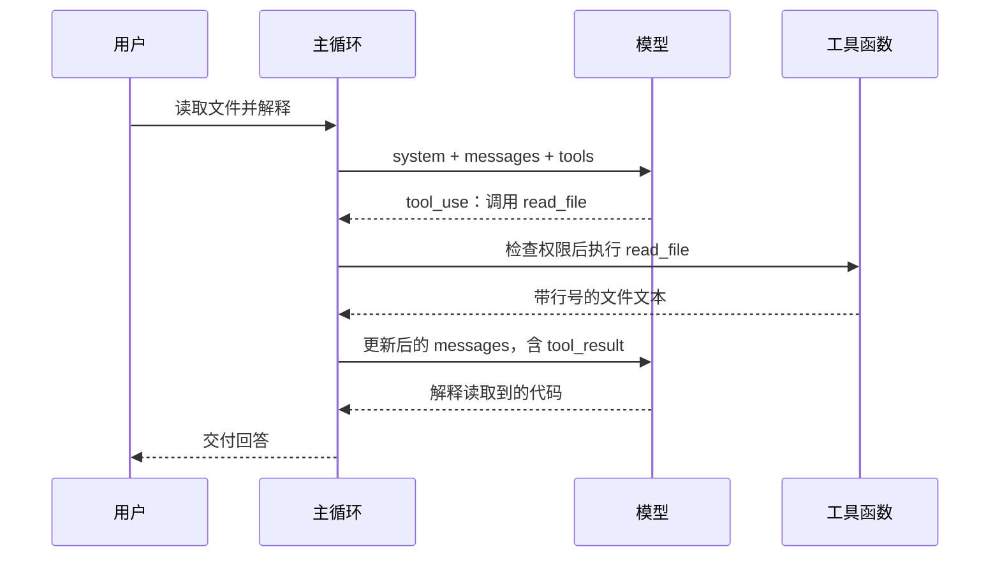

# mini-coding-agent 接口与数据流指南

> 先读懂一次调用，再按需要查接口细节。
>
> 本文根据 [API_PROTOCOL_SPEC.md](API_PROTOCOL_SPEC.md) 重新组织，沿用其源码基线 `cb4e694`，整理日期为 2026-10-04。原规范保留，完整字段、兼容分支和长示例可通过文末索引查阅。

## 怎么读这份文档

这份文档面向想看懂项目调用过程、再去阅读源码的人。这里的“协议”，指模块之间约定的数据形状和处理方式，既包括发给模型的消息，也包括工具返回值、后台通知和落盘文件。

第一次阅读，先看第 1～3 节，弄清“模型提出调用，程序执行工具，结果再交回模型”。接着看第 4～6 节，理解外部工具和后台工作怎样接入同一条主线。遇到具体问题，再查后面的运行规则。

| 你想弄清的问题 | 从这里开始 |
| --- | --- |
| 一次请求怎样走到最终回答？ | [1. 跟着一次文件读取走完流程](#first-call) |
| tools、tool_use、tool_result 有什么区别？ | [2. 看懂消息和返回值](#messages) |
| 工具名怎样对应到 Python 函数？ | [3. 工具执行](#tools) |
| MCP 工具怎样交给模型使用？ | [4. 外部工具](#mcp) |
| task_id、run_id 和子任务结果怎样对应？ | [5. 看板与子 Agent](#subagent) |
| 后台命令怎样回传结果？ | [6. 后台 Shell](#background) |
| 什么会阻止执行，什么时候算结束？ | [7. 权限、响应检查与异步](#runtime) |
| 历史太长、图片太大时怎么办？ | [8. 图片与上下文压缩](#context) |
| Memory、Skill、AGENT.md 各自有什么用？ | [9. 跨轮次信息与配置](#persistent-context) |
| 想核对完整消息或更多字段？ | [附录 A：完整消息](#full-example)、[附录 B：查阅索引](#reference) |

**示例约定：**本文的请求、响应和 ID 都是用于解释结构的合成示例，未作为真实服务调用执行。标注“节选”的代码只展示当前要讲的字段；SDK 响应以项目读取的属性展示。本文不展开完整 HTTP、SSE 或 JSON-RPC 报文，也不把本地预算当成模型服务的官方限制。

<a id="first-call"></a>

## 1. 跟着一次文件读取走完流程

假设用户提出请求：

> 读取 CodingAgent/messages.py 第 4 到 6 行，解释这段代码。

项目需要先让模型知道请求，再执行模型选择的工具，最后把读取结果交给模型。模型返回工具调用时，文件还没有被读取。



这是工具调用成功、没有后台工作需要等待、结束 Hook 没有要求继续的路径。下面把每一步拆开。

### 第一步：准备模型请求

入口把用户输入放进 `messages`。它是一个列表，按先后顺序保存消息：

```json
[
  {"role": "user", "content": "读取 CodingAgent/messages.py 第 4 到 6 行，解释这段代码。"}
]
```

主循环还会准备两样信息：

- `system`：本轮的整体指引，例如工作目录、项目约定和召回的记忆。
- `tools`：模型本轮可以选择的工具说明，包括名称、用途和参数格式。

同步入口的请求形态如下。这里的变量表示运行时已准备好的值，片段用于说明参数关系：

```python
response = client.messages.create(
    model=MODEL,
    system=system_prompt,
    messages=messages,
    tools=tools,
    max_tokens=16384,
)
```

`messages` 是交互历史，`system` 是单独传入的参数。当前项目不会在历史中另外构造一条 `role="system"` 消息。

### 第二步：模型提出工具调用

下面是模型响应中的一个内容块。`tool_use` 表示“请程序执行这个工具”：

```json
{
  "type": "tool_use",
  "id": "call_read_1",
  "name": "read_file",
  "input": {"path": "CodingAgent/messages.py", "offset": 4, "limit": 3}
}
```

只需要先看懂三个字段：`name` 决定调用哪个工具，`input` 提供参数，`id` 用来把稍后的结果与本次调用配对。主循环会先检查完整响应是否合法，再把模型响应保存为 `assistant` 消息。

### 第三步：程序执行工具

调度器负责检查工具调用能否执行，再找到对应函数。下面省略权限、错误处理和异步适配，只展示名称到函数的对应关系：

```python
handler = handlers[tool_call.name]
output = handler(**tool_call.input)
```

`handlers` 是“工具名称 → Python 函数”的映射。`**` 会把参数字典展开，因此这次执行等价于：

```python
read_file(path="CodingAgent/messages.py", offset=4, limit=3)
```

读取结果是普通字符串。按照原规范使用的仓库内容，例子如下：

```text
File: CodingAgent/messages.py
Lines 4-6 of 11
4: def extract_text(content) -> str:
5:     if not isinstance(content, list):
6:         return str(content)
Next offset: 7
```

`offset` 从 1 开始。若还需要下一页，模型可以使用返回的 `Next offset` 再发起一次调用。

### 第四步：把结果放回消息历史

程序把输出包装成 `tool_result`，再放进一条 `user` 消息：

```python
tool_result = {
    "type": "tool_result",
    "tool_use_id": tool_call.id,
    "content": output,
}
messages.append({"role": "user", "content": [tool_result]})
```

这里最关键的关联是：

```text
tool_use.id = call_read_1
                 ↓
tool_result.tool_use_id = call_read_1
```

`role="user"` 是消息协议中的角色。项目也使用这个角色承载工具结果和程序通知，所以历史中的 `user` 消息不一定是人刚输入的一句话。

### 第五步：模型读取结果，给出回答

下一次请求携带更新后的历史：用户请求、模型的工具调用、程序回填的工具结果。模型据此继续工作，或返回解释文字。

当模型给出合法的结束响应，主循环还会检查后台任务和结束 Hook。没有需要继续处理的工作时，完成 Memory 收尾，再结束这次用户请求。

同步入口从最后一条 `assistant` 消息提取回答并打印；异步入口通过流式输出显示文字。当前 `agent_loop` 正常返回的是 `None`，回答保存在消息历史中。

**继续看源码：**[同步请求与主循环][main]、[异步入口][async-main]、[工具调度器][dispatcher]。完整消息列表见[附录 A](#full-example)。

<a id="messages"></a>

## 2. 看懂消息和返回值

读后续模块前，先把几个经常一起出现的名称分开。

### 2.1 名称相似，职责不同

| 名称 | 回答的问题 | 本例中的内容 |
| --- | --- | --- |
| `tools` | 模型有哪些工具可以选？ | `read_file` 的说明和参数格式 |
| `tool_use` | 模型这次想调用什么？ | 读取指定路径的第 4～6 行 |
| `tool_result` | 这次调用返回了什么？ | 带行号的文件文本 |
| Handler | 程序具体执行哪个函数？ | 文件读取函数 |
| `ToolContent` | 工具输出可以是什么形状？ | 文本，或文本与图片内容块列表 |

`tools` 里的 `input_schema` 是给模型看的参数说明。例如 `required: ["path"]` 表示路径必填。程序执行时如何检查参数，要看对应函数及调度器的实现，不能只看 Schema。

### 2.2 一条消息可以包含多个内容块

消息有 `role` 和 `content`。`content` 可以是字符串，也可以是内容块列表：

| 内容块类型 | 作用 | 常见位置 |
| --- | --- | --- |
| `text` | 普通文字、提醒、完成通知 | `assistant` 或 `user` 消息 |
| `tool_use` | 模型提出工具调用 | `assistant` 消息 |
| `tool_result` | 程序回填执行结果 | `user` 消息 |
| `image` | 实际图片数据 | 例如 `tool_result.content` 内 |

模型同一响应可以提出多个工具调用。当前主循环按它们在列表中的顺序执行，再把全部结果放进一条 `user` 消息。每个结果用自己的 `tool_use_id` 配对。

### 2.3 看起来像 JSON，不一定返回的是对象

工具输出最容易混淆的地方是：屏幕上看到一个 JSON 对象，但函数实际返回的可能是一段字符串。

| 返回形态 | 例子 | 后续处理 |
| --- | --- | --- |
| 普通字符串 | 文件内容、Shell 输出 | 放进 `tool_result.content` |
| JSON 字符串 | 子 Agent 启动回执 | 仍放进 `content`；需要时再解析 |
| 内容块列表 | `read_image` 的文字和图片 | 作为 `content` 列表保留 |
| 内部对象 | `SubagentState`、Task、SDK 响应块 | 由对应模块读取或转换 |

例如下面的 Python 片段刻意展示“对象”和“编码后的字符串”的区别，字段是节选：

```python
receipt = {"status": "started", "run_id": "run_0123456789abcdef0123456789abcdef"}
encoded_receipt = json.dumps(receipt, ensure_ascii=False)
# receipt 是 dict；encoded_receipt 是 str。
```

当前 `normalize_tool_result` 会保留字符串，以及元素全部为 `text` / `image` 字典的非空列表。其他值调用 `str(value)`，不会自动变成 JSON。因此，工具需要返回 JSON 字符串时，应由它自己完成编码。

`<subagent_result>` 和 `<task_notification>` 也是文本里的标签；外层内容块的类型依然是 `text`。

**继续看源码：**[工具内容处理][images]、[子 Agent 工具适配][adapters]。完整格式见原规范第 1～3 节。

<a id="tools"></a>

## 3. 工具执行：从参数到结果

工具调用从模型响应到结果回填，中间会经过调度器。理解这段流程后，就能区分“模型请求了工具”和“工具确实执行了”。

```text
收到 tool_use
→ PreToolUse：记录调用、检查权限
→ 允许后执行 Handler，或启动后台命令
→ PostToolUse：观察执行结果
→ 归一化为 ToolContent
→ 主循环包装成 tool_result
```

权限拒绝时直接返回原因，Handler 和 PostToolUse 都不会执行。`PostToolUse` 观察的是 Handler 的原始返回值；其后才进行输出归一化。

### 3.1 先按用途找工具

当前基础工具有 18 个。每轮另外加入 `connect_mcp`，以及已经连接的 MCP 服务所提供的工具。

| 需要做的事 | 工具 | 主要输入 |
| --- | --- | --- |
| 阅读、定位代码 | `read_file`、`glob`、`grep` | 文件路径、匹配模式、搜索范围 |
| 修改文件 | `write_file`、`edit_file` | 路径、完整内容或待替换片段 |
| 执行命令 | `bash` | 命令；可选后台执行 |
| 读取图片 | `read_image` | 本地图片路径 |
| 加载技能说明 | `load_skill` | 技能名称 |
| 管理工作任务 | `create_task`、`update_task`、`list_tasks`、`get_task`、`claim_task`、`complete_task` | 任务描述、任务 ID、依赖 ID |
| 委派与跟踪子任务 | `task`、`subagent_status`、`subagent_cancel` | 看板任务 ID 或运行 ID |
| 压缩上下文 | `compact` | 空对象 |
| 连接外部工具服务 | `connect_mcp` | 配置中的服务名 |

### 3.2 读文件、搜代码时最常用的规则

| 工具 | 使用时需要记住的规则 |
| --- | --- |
| `read_file` | `path` 必填；`offset` 默认 1，`limit` 默认 200，最多 200 行；超出文件结尾返回 EOF 提示 |
| `grep` | 按单行字面文本搜索；默认范围 `.`，默认最多 100 条，最高 200 条；可加 `glob` 和 `ignore_case` |
| `glob` | 返回排序、去重的匹配路径；最多展示 200 条；匹配项可能包括目录 |
| `edit_file` | 替换首个匹配片段；找不到原片段时返回错误文字 |
| `write_file` | 写入新全文；成功提示中的 “bytes” 当前实际来自字符数 |
| `bash` | 名称叫 bash，但实际交给 `shell=True` 的系统 Shell 执行；未固定某个 Bash 程序 |

文件工具会限制解析后的路径必须位于工作区内。`grep` 输出中的 `Truncated: true` 是结果文本的一部分，表示搜索结果可能不完整。

### 3.3 工具出错后，模型看到什么

常见失败通过 `tool_result.content` 里的文字表达：

| 情况 | 典型结果 |
| --- | --- |
| 权限拒绝 | 拒绝原因文字 |
| 没找到对应 Handler | `Unknown: <tool_name>` |
| Handler 执行异常 | `Error: <exception text>` |
| MCP 工具报告失败 | `MCP error: ...` |

项目构造的工具结果外层包含 `type`、`tool_use_id`、`content`，没有统一添加 `is_error` 字段。模型需要结合结果内容判断下一步。

还有一些异常会直接上抛，例如 Hook 回调异常、模型请求前组装 MCP 工具池时发生的名称冲突。不能假设所有错误都能回填为工具结果。

**实现细节：**调度器没有统一的 JSON Schema 校验器。缺参数、多参数和类型错误怎样处理，取决于 Python 调用、具体 Handler 和 Hook。工具调用计数记录的是尝试次数，拒绝或未知工具也可能计入。

**继续看源码：**[工具 Schema][schemas]、[文件工具][files]、[Shell][shell]、[调度器][dispatcher]。完整输入字段与错误分支见原规范第 3 节。

<a id="mcp"></a>

## 4. MCP：把外部工具接到同一条调用流程里

内置工具的函数由项目直接提供。MCP 工具由外部服务提供，项目需要先发现工具，再把工具说明交给模型。模型选中它以后，程序把调用转发给对应服务。

下面假设有一个名为 `local` 的服务，提供 `read_file(path)`。这是合成场景，不代表仓库配置中存在该服务。

### 4.1 连接和发现：先让模型知道工具存在

```text
mcp.json 中的服务配置
→ connect_mcp(name="local")
→ 建立会话，逐页 list_tools
→ 保存发现的工具名称、说明、输入 Schema
→ 下一轮组装 tools 和 handlers
→ 模型看到 mcp__local__read_file
```

连接工具返回的是普通文本，例如：

```text
Connected to MCP server 'local'. Discovered 1 tools: read_file
```

**新工具从下一轮请求开始可见。** 当前这一轮的工具映射已经生成，连接成功不会直接修改这份已取出的映射。

模型看到的名称带有 `mcp__<服务>__<工具>` 前缀，用于区分来源。例如本地内置 `read_file` 与外部 `mcp__local__read_file` 是两个工具。

### 4.2 调用和返回：在边界处转换数据

假设模型选择外部工具，调用中的关键字段如下：

```json
{
  "type": "tool_use",
  "id": "call_mcp_1",
  "name": "mcp__local__read_file",
  "input": {"path": "README.md"}
}
```

Handler 已经绑定了服务客户端和远端原始工具名。实际转发使用 `read_file`，无需让远端认识模型侧的前缀：

```text
mcp__local__read_file(path="README.md")
→ client.call_tool("read_file", {"path": "README.md"})
→ 收到 MCP SDK 结果
→ 转换为 ToolContent
→ tool_result(tool_use_id="call_mcp_1")
→ 下一次模型请求
```

返回内容按下面的顺序处理：

| MCP 结果里有什么 | 交给主循环的内容 |
| --- | --- |
| 有图片 | 保存原图，返回文字元数据和图片内容块，保留内容顺序 |
| 无图片，有文本 | 用换行合并文本，返回字符串 |
| 无可用文本和图片，有 `structured_content` | 将其编码为 JSON 字符串 |
| 上述内容都没有 | 返回 `(empty MCP tool result)` |

若 `is_error` 为真，转换后的正文会带有 `MCP error:` 提示。这里的错误信息仍在结果内容中，没有映射为外层 `tool_result.is_error`。

### 4.3 配置和运行边界

每个服务配置使用 `command` 或 `url` 中的一个：前者用于启动本地进程，后者用于访问 HTTP 服务。`args`、`env` 配合本地进程使用，`headers` 配合 HTTP 地址使用。配置缺失或无效时，入口使用空 MCP 配置继续启动。

工具名需要规范化。最终名称超过 64 字符、与现有工具冲突，或顶层输入 Schema 不符合要求时，组装工具池会失败。具体业务参数来自运行时发现的 Schema。

外部 `mcp__...` 工具默认进入权限确认；策略为 `allow` 时直接放行。当前子 Agent 的工具白名单不包含 MCP 工具和 `connect_mcp`。

**继续看源码：**[MCP 配置][mcp-config]、[工具池与名称映射][mcp-manager]、[发现和结果转换][mcp-client]。连接生命周期、超时和完整样例见原规范第 4、14.3 节。

<a id="subagent"></a>

## 5. 看板与子 Agent：先记工作，再启动一次执行

看板记录“有哪些工作需要完成”；子 Agent 负责“为其中一项工作执行一次独立的分析”。看板任务可以保存在磁盘上，子 Agent 运行状态则保存在当前进程内。

理解这一节，先记住：**启动成功、执行结束、工作验收通过，是三个不同时间点。**

### 5.1 先区分三个 ID

| ID | 代表什么 | 用在哪里 |
| --- | --- | --- |
| `tool_use.id`，例如 `call_task_1` | 模型的一次工具调用 | 与即时 `tool_result` 配对 |
| `task_id`，例如 `task_a1b2c3d4` | 看板上的一项工作 | 认领、委派、验收后完成任务 |
| `run_id`，例如 `run_0123456789abcdef0123456789abcdef` | 子 Agent 的一次执行 | 查询、取消、关联最终结果 |

同一个已认领任务可以启动不同的子 Agent 运行。查询执行状态时要传 `run_id`。

### 5.2 从创建任务到验收，顺着读一遍

假设要委派子 Agent 检查 `extract_text` 的行为。主 Agent 的成功路径如下：

| 步骤 | 调用或事件 | 得到了什么 |
| --- | --- | --- |
| 1 | `create_task(subject, description)` | 看板生成 `task_id`，状态为 `pending` |
| 2 | `claim_task(task_id)` | 看板变为 `in_progress`，`owner="agent"` |
| 3 | `task(task_id, prompt)` | 立即收到启动回执和新的 `run_id` |
| 4 | 子 Agent 在后台读取代码 | 使用独立消息历史进行分析 |
| 5 | 主循环收到最终通知 | 得到状态、摘要、未完成事项和证据 |
| 6 | 主 Agent 核对证据 | 判断工作是否达到要求 |
| 7 | `complete_task(task_id)` | 看板变为 `completed` |

有依赖关系时，在认领前使用 `update_task` 添加依赖。只有依赖全部完成，任务才可以被认领；添加依赖还会检查自依赖和循环依赖。

看板目前只有 `pending`、`in_progress`、`completed` 三种状态。子 Agent 失败、取消或执行完成，都不会自动修改看板任务状态。

### 5.3 第一次返回：启动回执

成功启动后，`task` Handler 返回一段 JSON 字符串。下面展示字符串解析后的完整对象：

```json
{
  "status": "started",
  "task_id": "task_a1b2c3d4",
  "run_id": "run_0123456789abcdef0123456789abcdef",
  "message": "子 Agent 已启动。最终结果将自动作为 subagent_result 通知送达。"
}
```

这段字符串放进原调用的 `tool_result.content`，使用 `call_task_1` 配对。它说明子线程已经启动，此时还没有最终工作结论。

启动前会检查任务已被主 Agent 认领、提示词非空、管理器仍接收任务、并发名额可用。失败时返回 `status="not_started"`、`run_id=null` 和 `error`。

### 5.4 子 Agent 具体能做什么

子 Agent 初始历史只有传给它的 `prompt`，不会自动继承主 Agent 的整段对话。因此委派说明需要写清目标、必要背景、路径和期望交付物。

当前允许的工具是 `read_file`、`glob`、`grep`、`load_skill`。执行器会检查白名单。子 Agent 不能靠提示词获得文件修改、Shell 或 MCP 能力。

默认运行预算为 30 轮工作模型请求、600 秒工作时间；默认并发上限为 4。模型调用 `task` 时不能通过参数自定义这些值。中断收尾请求有单独的默认 20 秒预算。

子模型的最终文字按提示应包含两个字符串字段：

```json
{
  "summary": "extract_text 对非列表输入返回 str(content)。",
  "remaining": ""
}
```

程序再结合运行状态、响应记录和工具证据，整理出交给主 Agent 的完整结果。若模型没有按这个 JSON 格式返回，程序会保留原文，并提示主 Agent 核对剩余问题。

### 5.5 第二次交付：最终通知

子 Agent 执行与收尾结束后，Manager 发布结果。主循环通过 `collect()` 领取，再构造通知：

```python
block = {
    "type": "text",
    "text": "<subagent_result>\n" + result_json + "\n</subagent_result>",
}
```

`result_json` 是完整结果的 JSON 字符串。此块加入 `user` 消息，随下一次请求交给模型。它通过 `run_id` 和 `task_id` 关联工作，不重复生成原 `call_task_1` 的工具结果。

主 Agent 阅读结果时，可以按这个顺序看：

| 先看什么 | 为什么要看 |
| --- | --- |
| `status` | 执行是完成、失败、超时、预算耗尽还是取消？ |
| `summary`、`remaining` | 做了什么，还有什么没完成？ |
| `error`、`warnings` | 工作阶段或收尾阶段有什么问题？ |
| `evidence` | 实际调用过什么工具，返回了什么？ |
| `response_log`、计数 | 请求怎样结束，用了多少工作轮次和工具尝试？ |

`evidence` 的参数和输出各保留最多 1,200 字符预览，并用 `truncated` 标记是否截断。证据也可能记录工具拒绝或报错。`completed` 表示子运行到达完成状态，主 Agent 仍需验收具体工作。

### 5.6 查询、取消和自动通知怎样共存

`subagent_status(run_id)` 可以返回 `running`、`cancelling`、`not_found`，或已经发布的完整终态结果。查询不会领取自动通知。

`subagent_cancel(run_id)` 发出协作式取消信号。返回 `cancelling` 时，当前工具或模型请求可能仍需先结束或超时；发布 `cancelled` 才表示运行已经以取消状态结束。程序观察到取消后会整理已有记录，不再启动新的模型请求。

自动通知只领取一次，但子 Agent 已发布的结果仍保留在内存中，之后可以查询。进程重启后，旧 `run_id` 不能仅凭看板文件恢复。

如果主模型先给出结束文字，而后台运行还未结束，主循环会等待通知、把结果交回模型，再继续判断能否结束用户请求。

**继续看源码：**[任务看板][taskboard]、[启动与通知适配][adapters]、[运行管理器][sub-manager]、[执行器][sub-executor]、[结果整理][sub-results]。完整状态与通知示例见原规范第 5、6、14.4 节。

<a id="background"></a>

## 6. 后台 Shell：命令先启动，结果稍后送达

后台 Shell 与子 Agent 都会“先回执，后通知”，但执行内容不同：后台 Shell 运行一个命令；子 Agent 运行自己的模型与工具循环。

模型调用 `bash` 时，把 `run_in_background` 设置为布尔值 `true`，才会进入后台分支：

```json
{
  "command": "python -c \"print('ready')\"",
  "run_in_background": true
}
```

这里展示的是 `tool_use.input`。即时 `tool_result.content` 为：

```text
Background task started: bg_0001
The result will be collected and injected into the messages later.
```

后台命令完成后，主循环收到一段通知文本：

```xml
<task_notification>
  <task_id>bg_0001</task_id>
  <status>completed</status>
  <exit_code>0</exit_code>
  <command>python -c "print('ready')"</command>
  <summary>ready</summary>
</task_notification>
```

它放在 `user` 消息中的 `text` 内容块里。标签里的 `task_id` 是后台命令编号 `bg_0001`，与看板上的 `task_...` 属于不同编号体系。

退出码为 0 时通知为 `completed`；非零、未知退出码或执行异常会判为 `failed`。长输出存档成功时，通知还包含 `full_output` 路径，模型可以使用 `read_file` 查看全文。

**实现细节：**完成通知一次性领取后，会移除对应后台记录。当前没有注册 `background_status` 或 `background_cancel` 工具。空命令可能产生含 `Error: Invalid command` 的误导性启动文字，不能仅凭 “Background task started” 句式认定启动成功。

**继续看源码：**[后台任务][background-source]、[Shell 输出][shell]。完整通知字段见原规范第 7 节。

<a id="runtime"></a>

## 7. 权限、响应检查与异步：主循环怎样决定下一步

主循环既要接收模型的决定，也要检查响应是否完整、工具是否允许执行，以及是否还有后台工作需要处理。这些判断共同决定一次请求能否结束。

### 7.1 Hook 是执行到某个位置时调用的回调

Hook 可以理解为预留在执行流程里的函数调用点。注册的回调可以观察当前情况，也可以返回一个值，让调用方改变后续行为。

| Hook | 何时触发 | 本项目怎样使用返回值 |
| --- | --- | --- |
| `UserPromptSubmit` | 收到用户输入时 | 当前入口忽略返回值 |
| `PreToolUse` | 执行工具前 | 返回真值时阻止执行，并回填原因 |
| `PostToolUse` | 工具执行后 | 观察原始结果，返回值不替换工具输出 |
| `Stop` | 准备结束模型循环时 | 返回真值时作为新的用户内容，让循环继续 |

权限检查通过 `PreToolUse` 接入。权限方法返回 `None` 表示允许，返回原因字符串表示拒绝。命令拒绝规则命中后不会通过用户确认覆盖；需要交互确认的其他情况，输入 `y` 或 `yes` 才允许。

**实现细节：**HookRegistry 按注册顺序执行，遇到第一个“非 `None`”的结果就停止调用后面的回调。但调度器决定是否阻断时判断的是“真值”。所以 `False` 或空字符串会停止后续回调，却不会触发工具阻断；这两层判断需要分开理解。

子 Agent 使用 Stop Hook，但它的工具执行走自己的只读白名单，不经过主调度器的 Pre/Post Hook 或交互审批。

### 7.2 模型响应通过检查后，才进入有效历史

主 Agent 会结合 `stop_reason` 和内容判断响应：

| 响应情况 | 当前主 Agent 的处理 |
| --- | --- |
| `tool_use`，且确有工具调用块 | 接收响应，随后执行工具 |
| `end_turn`，有非空文本且没有工具调用 | 接收响应，再检查后台工作和 Stop Hook |
| `max_tokens`，表示输出达到上限 | 丢弃截断响应；最多重试一次，输出额度从 16,384 增加到 32,768 |
| 声称调用工具却没有调用块，或内容为空、仅有未知/思考块 | 最多重试一次 |
| `end_turn` 却包含工具调用，或其他停止原因 | 抛出 `IncompleteResponseError` |

达到输出上限的响应中即使出现了工具请求，也不会执行这些工具。主循环、子 Agent、压缩摘要使用不同的响应检查规则；上表只描述主 Agent。

主循环默认每 60 轮请求用户确认是否继续。额度耗尽、响应不完整或压缩失败导致主循环终止时，CLI 会报告未完成；此前已发生的文件修改不会自动撤销。

### 7.3 异步入口先显示文字，再拿完整响应

`main_async.py` 使用流式请求：

```text
messages.stream(...)
→ text_stream 逐段产生文字，立即显示
→ get_final_message() 取得完整响应
→ 校验 stop_reason 和 content
→ 保存合法响应，再执行工具
```

终端已经显示文字，不代表该响应已通过最终检查。被判为截断的内容可能已经显示过，但不会因此加入有效主历史。

异步适配也不会自动把同一批工具并行执行。它会等待当前工具完成，再处理下一个。指定的同步本地工具在线程中运行；返回协程的 Handler 会被 `await`。

异步主 Agent 使用异步模型客户端；Subagent、Memory、Compact 仍使用同步客户端。异步入口通过线程适配等待 Memory 和 Compact 完成，子 Agent 仍由线程管理器持有。

**继续看源码：**[Hook][hooks]、[权限][permissions]、[异步适配][async-support]、[主循环][main]。精确的取消、超时和重试规则见原规范第 2.3、2.4、9、12.3 节。

<a id="context"></a>

## 8. 图片与上下文压缩：减少本轮输入，保留后续查阅路径

消息历史会随着工具调用不断增长。项目会缩短长输出、清理旧图片数据，必要时用摘要替换旧历史，同时留下可重新读取的文件路径。

### 8.1 图片工具返回文字和图片两个部分

`read_image(path)` 返回内容块列表。文字部分记录图片路径和格式；图片部分携带实际 Base64 数据，让模型能够看图。

下面是工具输出的结构示例。路径和数据均为占位值，不能直接作为有效图片请求使用：

```json
[
  {
    "type": "text",
    "text": "Image file: <WORKDIR>/screenshots/result.png\nMedia type: image/png\nUse read_image(path) to reload this image after compaction."
  },
  {
    "type": "image",
    "source": {
      "type": "base64",
      "media_type": "image/png",
      "data": "<base64-image-data>"
    }
  }
]
```

这个列表会放进 `tool_result.content`。支持 PNG、JPEG、GIF、WebP，原图必须非空且不超过本地设定的 32 MiB。MCP 图片还会校验 Base64 和声明的 MIME 类型，成功后保存到工作区输出目录。

终端预览只显示图片数量、路径等文字，不打印 Base64。旧历史清理后会保留路径及重读提示；模型需要再次看图时，可以重新调用 `read_image`。

当前 CLI 只接收 query 文本，没有专门的用户图片附件入口。

### 8.2 长输出先保存文件，再留下预览

例如 Shell 输出过长时，结果会变成下面这种形式。此处预览正文已节选：

```text
<persisted-output>
Full output: <WORKDIR>/.task_outputs/tool-results/shell_<uuid>.txt
Preview:
这里是输出的首尾预览。
</persisted-output>
```

`Full output` 指向完整输出文件。模型需要细节时，再调用 `read_file` 读取它。

前台 Shell 超过 50,000 字符、后台 Shell 超过 500 字符时会尝试存档。若存档失败，会保留全文并说明失败，不交付一个虚假的成功路径。

要区分“终端显示截短”和“发给模型的结果被压缩”：单纯生成终端预览，不会改动原来的工具内容。

### 8.3 每轮请求前，检查能否装下当前上下文

压缩器同时估算 token、请求体字节和图片数量。处理顺序如下：

```text
在消息副本中处理最新批次的长文字输出
→ 能满足预算：返回候选历史
→ 仍超预算：缩短较旧、已经被模型消费的工具结果
→ 仍超预算：为旧历史生成摘要，保留近期交互
→ 再检查预算
→ 成功才替换主循环历史；失败则抛出错误
```

切分历史时要保证工具调用与结果配对，不把待消费的新结果随意切走。摘要后的历史大致由两部分组成：一条说明当前请求、摘要和转录路径的消息，以及最近的完整交互。

旧历史的文字转录保存到 `.transcripts/*.jsonl`。JSONL 表示每行一个 JSON 消息对象；图片数据在转录中被替换成文字提示，因此它不保存原始 Base64 全文。

本地默认上下文窗口为 1,000,000 token，token 与字节触发比例为 90%；主循环还预留 32,768 输出 token。token 估算采用字符权重，不能当成模型服务实际计费或 tokenizer 结果。

### 8.4 compact 工具怎样触发压缩

模型调用 `compact` 后，Handler 先返回说明文字。主循环执行完同批工具、补齐工具结果，再进行历史摘要。

此外，模型请求异常文字包含 `prompt_too_long` 或 `too many tokens` 时，主循环会尝试响应式压缩后重试。这种连续异常最多触发一次压缩重试，取得合法响应后重新计数。

**实现细节：**同步显式压缩在没有旧历史可摘要时可直接返回原历史；异步显式路径使用 `reactive_compact`，同样情况会报错。摘要不完整、返回工具请求、为空或没有有效减少上下文时，也不会提交候选历史。

**继续看源码：**[图片与内容块][images]、[压缩器][compact]、[预算估算][context-budget]。完整预算、存档标记和失败分支见原规范第 8、10 节。

<a id="persistent-context"></a>

## 9. Memory、Skill、项目指引与配置

这几类信息都会影响模型行为，但进入请求的时间和方式不同。先分清它们各自提供什么，再看落盘位置。

### 9.1 三种信息怎样进入模型上下文

| 信息 | 用途 | 进入模型的方式 |
| --- | --- | --- |
| Memory | 保存与后续工作有关的长期记录 | 用户请求开始时召回，作为 system prompt 文本 |
| Skill | 提供某类任务的具体操作说明 | system prompt 提供目录；模型调用 `load_skill` 后，正文作为工具结果返回 |
| 根目录 `AGENT.md` | 提供项目级约定 | 启动时读取，加入主 / 子 Agent 的 system prompt |

Skill 文件提供说明文字，不会因此增加工具或扩大子 Agent 权限。当前项目只加载根目录的 `AGENT.md`，没有逐层遍历子目录指引。

### 9.2 Memory 从召回到保存

```text
本次请求开始
→ 从记忆目录选择相关记录
→ 读取正文，放入 system prompt
→ 主 Agent 完成工作
→ 从对话提取候选长期记录
→ 校验、去重后保存
→ 本次写入了新记录时，再检查是否需要合并
```

选择阶段，辅助模型返回目录索引数组，例如 `[0, 2]`；这些数字只对应本次目录的位置。召回结果是一段 JSON 字符串；解析后是数组，每个元素包含 `source`（文件名）和 `content`（召回内容）两个字符串字段。没有召回内容时返回空字符串。

提取阶段的候选包含 `name`、`type`、`scope`、`description`、`body`。只有 `scope="persistent"` 的候选可能被保存，还要通过临时内容过滤和去重。记录类型包括 `user`、`feedback`、`project`、`reference`。

记忆文件的开头元数据包含名称、描述和类型，正文保存具体内容；索引文件只提供链接和描述。模型实际获得的记忆正文，以本次真正召回的内容为准。

默认最多召回 5 个文件，正文累计默认最多 20,000 字符。记录超过 40 条时才满足合并数量条件；“合并后最多 30 条”是提示词要求，程序没有再次按这个数量截断。

提取和合并返回的是数量，加载返回的是字符串，三者不能当成同一种结果对象。具体失败和回滚边界见原规范第 11 节。

### 9.3 路径从启动工作目录推导

`WORKDIR` 来自启动时的当前目录，不固定为源码所在目录。相关文件位置如下：

| 相对工作目录的位置 | 保存什么 |
| --- | --- |
| `tasks/` | 看板任务 JSON 文件 |
| `.memory/` | 记忆正文及 `MEMORY.md` 索引 |
| `.transcripts/` | 压缩前历史的文字转录 |
| `.task_outputs/tool-results/` | 工具长输出，及其中的 MCP 图片目录 |
| `skills/` | 技能说明文件 |
| `AGENT.md` | 根项目指引 |
| `mcp.json` | 外部工具服务配置 |

模型名称从 `ANTHROPIC_MODEL` 读取；当前代码没有默认模型回退。客户端还读取 `ANTHROPIC_API_KEY` 和 `ANTHROPIC_BASE_URL`。默认并发数与上下文窗口是项目配置值，当前 `load_config` 没有从环境变量读取这两项。

**继续看源码：**[Memory 管理器][memory-manager]、[Memory 存储][memory-store]、[Skill 加载][skills]、[项目指引][instructions]、[配置][config]。完整数据格式见原规范第 11、12 节。

<a id="full-example"></a>

## 附录 A：把第一节的完整消息放在一起

这一节用于核对消息嵌套关系，首次阅读可以略过。

下面展示第一节成功路径的完整 `messages`：用户请求、模型调用工具、程序回填结果、模型最终回答。模型生成的内容块在此按字典展示；实际主循环可以保存 SDK 内容块对象。

该列表是合成示例，不是完整 API 请求体。模型请求还会单独传入 `model`、`system`、`tools` 和 `max_tokens`。

```json
[
  {
    "role": "user",
    "content": "读取 CodingAgent/messages.py 第 4 到 6 行，解释这段代码。"
  },
  {
    "role": "assistant",
    "content": [
      {
        "type": "tool_use",
        "id": "call_read_1",
        "name": "read_file",
        "input": {"path": "CodingAgent/messages.py", "offset": 4, "limit": 3}
      }
    ]
  },
  {
    "role": "user",
    "content": [
      {
        "type": "tool_result",
        "tool_use_id": "call_read_1",
        "content": "File: CodingAgent/messages.py\nLines 4-6 of 11\n4: def extract_text(content) -> str:\n5:     if not isinstance(content, list):\n6:         return str(content)\nNext offset: 7"
      }
    ]
  },
  {
    "role": "assistant",
    "content": [
      {
        "type": "text",
        "text": "这段代码定义了 extract_text 函数。当 content 不是列表时，它会返回 str(content)，即将输入转换成字符串。"
      }
    ]
  }
]
```

第一次模型响应的 `stop_reason` 为 `tool_use`，最后一次为 `end_turn`。`stop_reason` 属于响应属性，没有被主循环作为消息顶层字段加入上面的历史列表。

<a id="reference"></a>

## 附录 B：进一步查阅与容易混淆的地方

### B.1 需要哪些细节，到原规范哪里找

下面的章节号对应保留的 [API_PROTOCOL_SPEC.md](API_PROTOCOL_SPEC.md)。新指南帮助建立调用过程，原规范提供逐字段和边界查阅。

| 查阅内容 | 原规范位置 |
| --- | --- |
| 全部协议清单、外部／适配／内部分类 | Protocol Inventory、第 1 节 |
| 各类模型请求参数、响应重试 | 第 2 节 |
| 每个工具的全部输入字段、默认值和输出 | 第 3 节 |
| MCP 配置、分页发现、名称转换、会话生命周期 | 第 4 节 |
| 看板 JSON、依赖约束、提醒消息和 ID | 第 5 节 |
| 子运行状态、最终 JSON、response_log、evidence | 第 6 节 |
| 后台命令登记、通知标签、长输出路径 | 第 7 节 |
| 图片字段、校验、预览、重读 | 第 8 节 |
| Hook、权限返回值、异步取消边界 | 第 9 节 |
| 预算估算、存档阈值、摘要和转录 | 第 10 节 |
| Memory 候选、保存、召回和合并 | 第 11 节 |
| 配置、Skill、项目指引、状态分类 | 第 12 节 |
| 实验结果、历史 TODO、兼容分支 | 第 13 节 |
| 普通回答、双工具、MCP、Subagent 的完整历史 | 第 14 节 |

实验 `result.json` 由手动运行实验脚本产生，与主 Agent 的 `tool_result` 属于不同格式。`agent_returned` 只表示 Agent 已返回，还需要看验收结果或人工复核。实验运行 ID 也不同于子 Agent 的 `run_id`。

历史 TODO 实现仍在仓库中，但当前没有注册为模型工具；它没有看板任务的 ID、依赖与持久化协议。阅读旧代码时，应先确认调用链是否仍在使用。

### B.2 阅读或讲解时，先检查这六个区别

| 容易混淆的说法 | 应当保留的区别 |
| --- | --- |
| “模型调用了工具，所以工作已经做完” | 模型提出调用之后，程序还要检查权限、执行并回填结果 |
| “JSON 示例就是函数返回的字典” | 某些工具返回的是 JSON 字符串；展示时可能已经解析 |
| “子 Agent completed，看板也就完成了” | 子运行结束后，主 Agent 仍需验收并调用 `complete_task` |
| “异步入口里的工具会一起执行” | 同批工具依然按顺序等待，后台工作通过另外的管理器运行 |
| “终端显示过的文字都进了模型历史” | 流式文字还要通过最终响应检查；终端预览也不等于完整工具内容 |
| “示例、离线测试通过，就是外部服务验证通过” | 本文示例说明结构；真实模型、MCP 和端到端能力需要另行实测 |

### B.3 这份指南的依据与维护方式

本文以原规范为整理依据，并抽查了消息提取、工具调度、子 Agent 启动和结果整理的代码。源码链接用于继续追踪实际行为；本次写作没有重新执行模型、MCP、实验脚本或整套测试。

后续接口变更时，先核对对应代码与原规范，再更新本指南的流程、关键字段和示例。对只影响某个边界条件的变化，优先更新对应模块的“实现细节”，保持首次阅读的主线连贯。

[main]: ../main.py
[async-main]: ../main_async.py
[dispatcher]: ../CodingAgent/tools/dispatcher.py
[schemas]: ../CodingAgent/tools/schemas.py
[files]: ../CodingAgent/tools/files.py
[shell]: ../CodingAgent/tools/shell.py
[images]: ../CodingAgent/images.py
[adapters]: ../CodingAgent/tools/adapters.py
[mcp-config]: ../CodingAgent/mcp/config.py
[mcp-manager]: ../CodingAgent/mcp/manager.py
[mcp-client]: ../CodingAgent/mcp/client.py
[taskboard]: ../CodingAgent/taskboard.py
[sub-manager]: ../CodingAgent/subagent/manager.py
[sub-executor]: ../CodingAgent/subagent/executor.py
[sub-results]: ../CodingAgent/subagent/results.py
[background-source]: ../CodingAgent/background.py
[hooks]: ../CodingAgent/hooks.py
[permissions]: ../CodingAgent/permissions.py
[async-support]: ../CodingAgent/async_support.py
[compact]: ../CodingAgent/compact.py
[context-budget]: ../CodingAgent/context_budget.py
[memory-manager]: ../CodingAgent/memory/manager.py
[memory-store]: ../CodingAgent/memory/store.py
[skills]: ../CodingAgent/skill_loader.py
[instructions]: ../CodingAgent/project_instructions.py
[config]: ../CodingAgent/config.py
